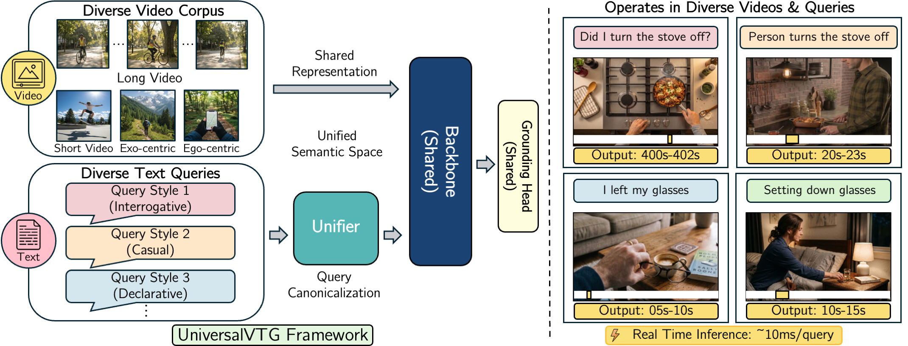
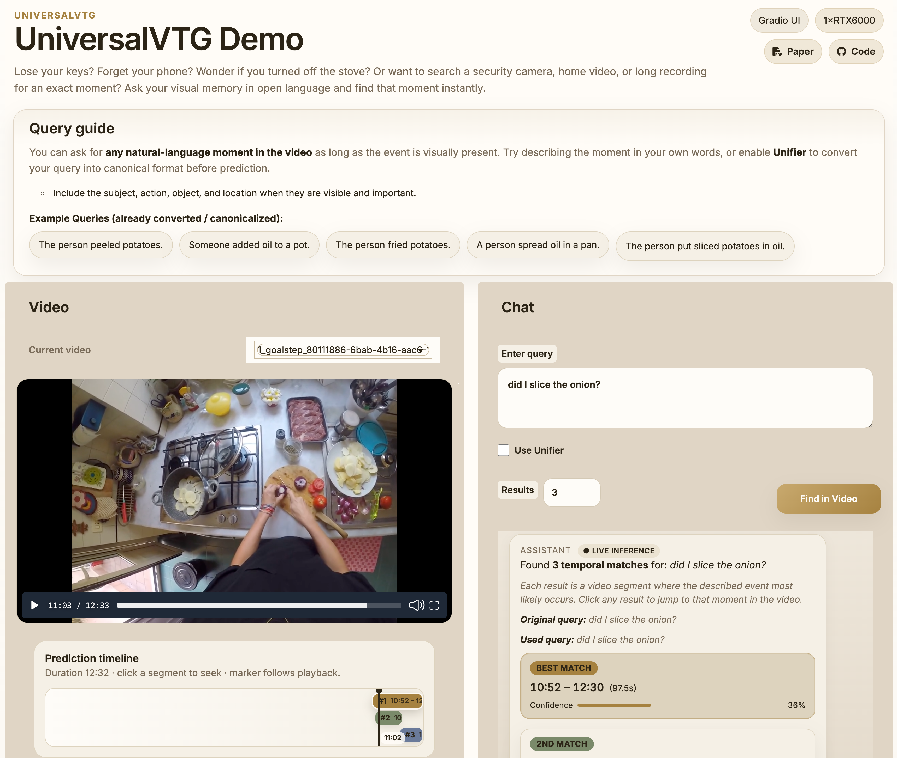

# UniversalVTG: A Universal and Lightweight Foundation Model for Video Temporal Grounding

[Joungbin An](https://sites.google.com/view/joungbinan/), Agrim Jain, [Kristen Grauman](https://www.cs.utexas.edu/~grauman/)

[[Paper (PDF)](https://arxiv.org/abs/2604.08522 )] [[Project Page](https://vision.cs.utexas.edu/projects/universalvtg/)] [[Demo](https://universalvtg.vision.cs.utexas.edu/)]

This repository is the official code release for the UniversalVTG paper.

<p align="center">
  
</p>

## 🎬 Try the Interactive Demo!

**UniversalVTG runs live in your browser — no setup required.**
Ask any natural-language question about a video and get instant temporal predictions.

<p align="center">
  <a href="https://universalvtg.vision.cs.utexas.edu/">
    <br>
    <b>▶ Launch Interactive Demo</b>
  </a>
</p>

## Installation

See [INSTALL.md](INSTALL.md) for full setup instructions including environment creation, dependencies, and build steps.

**Quick start:**

```bash
git clone --recurse-submodules https://github.com/jbistanbul/universalvtg.git
cd universalvtg
conda env create -f environment.yml
conda activate universal_vtg_release
bash install.sh
```

## Usage

The `UniversalVTG` class provides a simple, self-contained inference API.
Load the model once, then call `predict` or `predict_video` with any combination of inputs.

The model operates on visual features extracted at **2 FPS** (the default extraction rate).
FPS and duration are handled automatically — predictions are always returned in seconds.
Duration is estimated from the feature length; for more accurate clamping, you can pass `duration` (in seconds) explicitly.

Before running, download the pretrained checkpoint and place it under the expected path:

```
experiments/universalvtg/
├── opt.yaml
└── models/
    └── best.pth
```

Download: [[Checkpoint (UT Box)](https://utexas.box.com/s/vm52tyvfqxhrnmnswm4kbe8cr1fkke6e)]

### Pre-extracted video & text features

```python
import torch
from universal_vtg_inference import UniversalVTG

model = UniversalVTG()  # loads checkpoint from experiments/universalvtg/

vid_features = torch.load("video_features.pt")    # (feature_dim, T)
text_features = torch.load("text_features.pt")     # (feature_dim, L)

results = model.predict(vid_features, text_features)
```

### Video features + raw text query (auto-encodes text via Perception Encoder)

```python
import torch
from universal_vtg_inference import UniversalVTG

model = UniversalVTG()

vid_features = torch.load("video_features.pt")     # (feature_dim, T)
results = model.predict(vid_features, "a person cooking on the stove")
```

### End-to-end from video file + raw text query (auto-encodes both)

```python
from universal_vtg_inference import UniversalVTG

model = UniversalVTG()
results = model.predict_video("cooking.mp4", "a person cooking on the stove")
```

### Output format

All three methods return a dictionary with the same structure:

| Key | Shape | Description |
|-----|-------|-------------|
| `segments` | list of `(N, 2)` tensors | Predicted `[start, end]` timestamps in seconds |
| `scores` | list of `(N,)` tensors | Confidence score for each segment |

## Data preparation

### Annotations

Download: [[Annotations (UT Box)](https://utexas.box.com/s/uue77d6wpgyeu1u8dqgon1eyxe2dupvo)]

The download contains the following structure:

```
annotations/
├── finetuning/          # VTG benchmark annotations
│   ├── original/        # original annotations
│   ├── qwen3-4b/        # converted by Query Unifier (Qwen3-4B)
│   ├── llama31-70b/     # converted by Query Unifier (LLaMA-3.1-70B)
│   └── gpt5/            # converted by Query Unifier (GPT-5)
└── pretraining/         # pretraining annotations
    ├── original/        # original annotations
    └── llama31-70b/     # converted by Query Unifier (LLaMA-3.1-70B)
```

The `original/` folders contain the unmodified annotations for each benchmark. The other folders contain annotations whose queries have been canonicalized using the Query Unifier with the corresponding LLM backbone.

### Pre-extracted features

Download: [[Features (UT Box)](https://utexas.box.com/s/l9zm74v2wkljjaz35nmf9idhysjr5bc1)]

Pre-extracted visual and text features (Unified texts using Unifier with GPT5) for all supported datasets:

```
data/
├── goalstep/
│   ├── pecorel14_2fps/   # visual features (Perception Encoder L14, 2 FPS)
│   └── text/             # text features (Perception Encoder text encoder)
├── nlq/
│   ├── pecorel14_2fps/
│   └── text/
├── tacos/
│   ├── pecorel14_2fps/
│   └── text/
├── charades/
│   ├── pecorel14_2fps/
│   └── text/
└── anet/
    ├── pecorel14_2fps/
    └── text/
```

### Config setup

Update the following paths in the YAML configs under `opts/` for each dataset:

1. **Annotation files** (`.json`) — set `anno_file` in the config
2. **Visual features** — set `vid_feat_dir` (or extract your own using `feature_extraction/extract_visual_features.py`)
3. **Text features** — set `text_feat_dir` (or extract your own using `feature_extraction/extract_text_features.py`)

All three fields (`anno_file`, `vid_feat_dir`, `text_feat_dir`) must be filled in for every dataset entry before running training or evaluation.

## Feature extraction

If you want to extract your own visual or text features (e.g., for new videos or datasets), use the scripts below.
Pre-extracted features for the supported benchmarks are available above (see [Pre-extracted features](#pre-extracted-features)).

### Visual features (Perception Encoder backbone)

```bash
python feature_extraction/extract_visual_features.py \
  --videos_root /path/to/raw_videos \
  --save_dir /path/to/output_visual_features \
  --encoder pe \
  --read_fps 2.0
```

### Text features (Perception Encoder text encoder)

```bash
python feature_extraction/extract_text_features.py \
  --json_path /path/to/annotations.json \
  --model_type pe \
  --feature_type poolandtoken \
  --output_dir /path/to/output_text_features
```

## Supported workflows

### 1. Evaluation

```bash
python eval_from_config.py \
  --name <experiment_name> \
  --config opts/eval/multidata_evaluation.yaml \
  --ckpt best
```

To evaluate a checkpoint from an external directory:

```bash
python eval_from_config.py \
  --experiment_root /path/to/experiment_folder \
  --config opts/eval/multidata_evaluation.yaml \
  --ckpt best
```

### 2. Finetuning

```bash
python train.py \
  --opt finetune/multidataset_finetuning.yaml \
  --name <finetune_run_name>
```

If you want pretrained initialization, set `train.pretrain_checkpoint` in the YAML to your checkpoint path.

### 3. Multi-node pretraining

```bash
torchrun \
  --nproc_per_node=<gpus_per_node> \
  --nnodes=<num_nodes> \
  --node_rank=<node_rank> \
  --master_addr=<master_addr> \
  --master_port=<master_port> \
  train_multinode.py \
  --opt pretrain/multinode_multidataset_pretraining.yaml \
  --name <pretrain_run_name>
```

## Notes and limitations

- CUDA is required for training, evaluation, and Perception Encoder feature extraction.
- The 1D NMS extension should be rebuilt whenever the Python / PyTorch build environment changes.
- The `perception_models` submodule is subject to the upstream [Meta/Fair license](https://github.com/facebookresearch/perception_models).

## Acknowledgments

This codebase builds on [HieraMamba](https://github.com/jbistanbul/hieramamba). It also uses the upstream [`perception_models`](https://github.com/facebookresearch/perception_models) repository for Perception Encoder support and a runtime subset of [`hydra`](https://github.com/goombalab/hydra).

## Citation
If you find UniversalVTG useful for your research and applications, please consider giving a star ⭐ and citing using the following BibTeX:
```bibtex
@article{an2026universalvtg,
  title={UniversalVTG: A Universal and Lightweight Foundation Model for Video Temporal Grounding},
  author={An, Joungbin and Jain, Agrim and Grauman, Kristen},
  journal={arXiv preprint arXiv:2604.08522},
  year={2026}
}
```

```bibtex
@article{an2025hieramamba,
  title={HieraMamba: Video Temporal Grounding via Hierarchical Anchor-Mamba Pooling},
  author={An, Joungbin and Grauman, Kristen},
  journal={arXiv preprint arXiv:2510.23043},
  year={2025}
}
```
